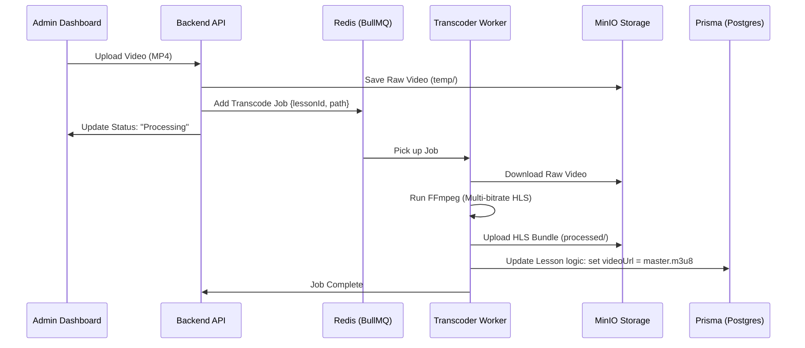

# Implementation Plan: Backend Transcoder Microservice (HLS Video Processing)

DO NOT CODE UNTIL I EXPLICITLY SAY "Start Coding Dude" 

first look at my code base implementation, a proper exploration for the coding practices and standards. All those should be followed properly (VVVVI - MUST BE DONE)!! The code you do should be exact same pattern.

This plan outlines the creation of a dedicated microservice to handle video transcoding for the "Learn" module. It will convert raw user-uploaded videos into adaptive HLS streams (Master Playlist + TS segments) for seamless playback.

## User Review Required

> [!IMPORTANT]
> **Infrastructure Requirements**
> - **FFmpeg**: The transcoder requires FFmpeg to be installed on the host or inside the container.
> - **Redis**: Used as the message broker for BullMQ.
> - **MinIO (S3)**: Used for both temporary and processed video storage.

---

## Proposed Changes

### 1. Transcoder Microservice [NEW]

We will initialize a new workspace package `apps/transcoder`.

#### [NEW] `apps/transcoder/package.json`
- Dependencies: `bullmq`, `fluent-ffmpeg`, `@aws-sdk/client-s3`, `dotenv`, `typescript`.

#### [NEW] `apps/transcoder/src/worker.ts`
- Core logic to listen to the `video-transcode` queue.
- Downloads raw files, runs FFmpeg with multi-resolution settings, and uploads results.

#### [NEW] `apps/transcoder/src/processor.ts`
- Encapsulated FFmpeg logic to generate:
    - 360p, 480p, 720p, 1080p variants.
    - Master `.m3u8` playlist.

### 2. Backend API (`apps/backend`)

#### [MODIFY] `modules/course/lessons/lesson.service.ts`
- Add logic to accept video uploads.
- Integrate with `MinioService` to store raw files.
- Add job to BullMQ queue when a video is updated.

#### [NEW] `shared/queue/video.queue.ts`
- Shared BullMQ configuration for adding transcoding jobs.

### 3. MinIO Configuration

#### [MODIFY] `docker-compose.yml` (Optional)
- Ensure a new bucket `devio-videos` is auto-created or documented.

---

## Workflow Diagram

## Open Questions

1. **Local vs Cloud Transcoding**: Should we use local FFmpeg for development, or simulate a cloud-based transcoder (like AWS Elemental) via an abstraction? (Recommendation: Local FFmpeg + Docker).
2. **Bucket Policies**: Do we need to make the `processed/` bucket public for streaming, or use signed URLs? (Recommendation: Public-read bucket for static segments).

---

## Verification Plan

### Manual Verification
1. **Upload Test**: Use Postman or Admin UI to upload a 10MB MP4.
2. **Queue Check**: Verify the job appears in Redis (using `bull-board` or CLI).
3. **Logs Check**: Monitor Transcoder logs for FFmpeg progress.
4. **Playback**: Verify the `.m3u8` URL plays correctly in the Course Player (Vidstack).

### Automated Tests
- Unit tests for the Transcode Processor (FFmpeg command builder).
- Integration test for Queue job addition.
